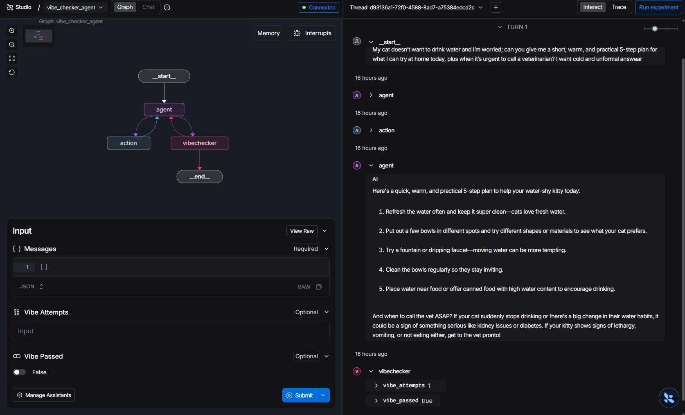

<p align = "center" draggable="false" >
</p>

## <h1 align="center" id="heading">Session 15: Build & Serve Agentic Graphs with LangGraph</h1>

| 📰 Session Sheet                                             | ⏺️ Recording                           | 🖼️ Slides                                  | 👨‍💻 Repo    | 📝 Homework                                      | 📁 Feedback                                          |
| ------------------------------------------------------------ | -------------------------------------- | ------------------------------------------- | ------------- | ------------------------------------------------ | ---------------------------------------------------- |
| [Agent Servers](https://github.com/AI-Maker-Space/AIE9/tree/main/00_Docs/Session_Sheets/15_Agent_Servers) |[Recording!](https://us02web.zoom.us/rec/share/lORjByDju6fv4TdE3r93dorY3aNgmSKL_Qk_cX_AMcCQ6cNfSW77unaA1LMVV60.OcI8uEnfVmRAgjSn) <br> passcode: `Dc@&pv1T`| [Session 15 Slides](https://www.canva.com/design/DAG-EJqkRaM/FR3WG_yMA5_BqbWpQlHR9g/edit?utm_content=DAG-EJqkRaM&utm_campaign=designshare&utm_medium=link2&utm_source=sharebutton) | You are here! | [Session 15 Assignment: Agent Servers](https://forms.gle/Vb3HNDsyVPQ1jqKX7) | [Feedback 3/3](https://forms.gle/kYmhbVUEMog16mKv8) |

### Prerequisites

Before starting, ensure you have the following:

- **Python 3.11+** installed
- An **OpenAI API Key**
- A **Tavily API Key**
- (Optional) **LangSmith** credentials for tracing

Create a `.env` file in this directory with your API keys:
   ```
   OPENAI_API_KEY=your_openai_api_key_here
   TAVILY_API_KEY=your_tavily_api_key_here
   ```
2. Run `uv sync` to install dependencies.

# Build 🏗️

Run the repository and complete the following:

- 🤝 Breakout Room Part #1 — Building and serving your LangGraph Agent Graph
  - Task 1: Getting Dependencies & Environment
    - Configure `.env` (OpenAI, Tavily, optional LangSmith)
  - Task 2: Serve the Graph Locally
    - `uv run langgraph dev` (API on http://localhost:2024)
  - Task 3: Call the API from a different terminal
    - `uv run test_served_graph.py` (sync SDK example)
  - Task 4: Explore assistants (from `langgraph.json`)
    - `agent` → `simple_agent` (tool-using agent)
    - `agent_helpful` → `agent_with_helpfulness` (separate helpfulness node)

- 🤝 Breakout Room Part #2 — Using LangSmith Studio to visualize the graph
  - Task 1: Open Studio while the server is running
    - https://smith.langchain.com/studio?baseUrl=http://localhost:2024
  - Task 2: Visualize & Stream
    - Start a run and observe node-by-node updates
  - Task 3: Compare Flows
    - Contrast `agent` vs `agent_helpful` (tool calls vs helpfulness decision)

<details>
<summary>🚧 Advanced Build 🚧 (OPTIONAL - <i>open this section for the requirements</i>)</summary>

>NOTE: This can be done in place of the Main Assignment

- Create and deploy a locally hosted MCP server with FastMCP.
- Extend your tools in `tools.py` to allow your LangGraph to consume the MCP Server.

When submitting, provide:
- Your Loom video link demonstrating the MCP server integration
- The GitHub URL to your completed Advanced Build

Have fun!
</details>

### Questions & Activities

#### Question 1:
What is the key architectural difference between the `simple_agent` and `agent_with_helpfulness` graphs? Specifically, explain how the helpfulness evaluation loop works and what mechanisms are in place to prevent it from running indefinitely.

##### Answer:
The fundamental architectural difference is that simple_agent ends as soon as the model returns a response that does not require a tool call, while agent_with_helpfulness runs an additional evaluation node after each such response to check whether the answer is actually helpful to the user.

In the helpfulness evaluation loop, after the agent generates a response, the conditional function route_to_action_or_helpfulness checks whether the message contains tool calls. If it does, the tools are executed as usual. If it does not, the flow moves to the helpfulness_node, which uses a separate LLM (gpt-4.1-mini with structured output) to compare the initial query with the final response and decide whether the response is “extremely helpful”. The evaluation result is appended to the message state as HELPFULNESS:Y or HELPFULNESS:N. Then helpfulness_decision decides: if the response is helpful, the graph ends; if not, the loop returns back to the agent node to try generating a better answer.

The loop has two safeguards to prevent it from running indefinitely. First, helpfulness_node checks how many messages are already in the state and, if the message count exceeds 10, it does not call the evaluation model at all and instead immediately returns the marker HELPFULNESS:END. Then helpfulness_decision looks for that marker and, if it sees it, it sends the flow straight to END and stops the loop regardless of whether the answer has actually become helpful.

NODE EXECUTION FLOW
START
 │
 ▼
graph.add_edge(START, "agent")          ← go to "agent" node
 │
 ▼
call_model(state)                       ← same as in simple_agent
 │
 ├── _build_model_with_tools()
 │    ├── get_chat_model()              ← ChatOpenAI instance
 │    └── model.bind_tools(get_tool_belt())
 │
 └── response = model.invoke(messages)
      └── return {"messages": [response]}
 │
 ▼
route_to_action_or_helpfulness(state)   ← conditional function (NOT tools_condition like before!)
 │                                        checks: does last_message have tool_calls?
 │
 ├── YES: has tool_calls ───────────────────────────────────────┐
 │                                                              ▼
 │                                                   ToolNode.invoke(state)   ← "action" node
 │                                                    ├── TavilySearch.invoke()
 │                                                    ├── ArxivQueryRun.invoke()
 │                                                    └── retrieve_information()
 │                                                         └── (same RAG flow as before)
 │                                                            │
 │                                          graph.add_edge("action", "agent")
 │                                                            │
 │                                                            └──► back to call_model ↑
 │
 └── NO: no tool_calls ──────────────────────────────────────────┐
                                                                 ▼
                                                      helpfulness_node(state)    ← "helpfulness" node
                                                       │
                                                       ├── CHECK: len(messages) > 10?
                                                       │    └── YES → return AIMessage("HELPFULNESS:END")
                                                       │              (skip LLM evaluation)
                                                       │
                                                       └── NO → continue evaluation
                                                            │
                                                            ├── initial_query = messages[0]
                                                            ├── final_response = messages[-1]
                                                            │
                                                            ├── get_chat_model("gpt-4.1-mini")
                                                            │    └── .with_structured_output(HelpfulnessResult)
                                                            │
                                                            ├── _helpfulness_prompt | structured_model
                                                            │    └── .invoke({initial_query, final_response})
                                                            │         └── returns HelpfulnessResult(is_helpful=True/False)
                                                            │
                                                            └── return AIMessage("HELPFULNESS:Y")  ← if helpful
                                                                 OR  AIMessage("HELPFULNESS:N")  ← if not helpful
                                                       │
                                                       ▼
                                              helpfulness_decision(state)        ← new conditional function
                                               │
                                               ├── messages[-1] == "HELPFULNESS:END"?
                                               │    └── YES → END  (hard limit reached)
                                               │
                                               ├── "HELPFULNESS:Y" in text?
                                               │    └── YES → END  (response is good enough)
                                               │
                                               └── "HELPFULNESS:N"?
                                                    └── YES → "agent"  ← back to call_model, try again ↑

#### Question 2:
What is the role of `langgraph.json` in the LangGraph Deployments? Describe each of its key fields and how the platform uses this file to discover and serve your graphs.

##### Answer:
langgraph.json is the project’s deployment manifest which the LangGraph platform reads at startup to discover which graphs exist, how to import them, what runtime to use, and which graphs should be exposed as served “assistants.”
version specifies the schema version of the manifest so the platform can parse the file correctly. dependencies tells the platform what to install into the runtime environment. The value "." means “install this repository as a package” (equivalent to pip install .). env points to an environment file (here .env) that is loaded so secrets and configuration (like API keys) come from environment variables rather than being hardcoded. python_version declares which Python version should be used to build and run the deployment environment. The graphs field is the core of the file, it maps graph IDs (strings) to Python import paths in the form module.path:object_name, and the platform uses these import strings to dynamically import and load each compiled graph. assistants is a layer on top of graphs: it defines “public” served assistants, each of which references a graph_id from the graphs map and provides metadata like name and description for the UI/API. This indirection enables exposing the same underlying graph under different assistant IDs and descriptions without changing the graph code.

#### Activity #1:
Create your own agent graph! Build a new graph in `app/graphs/` with a custom evaluation node (e.g., a vibe checker, a fact verifier, a summarizer — get creative!). Register it in `langgraph.json`, serve it with `uv run langgraph dev`

##### Answer:
I implemented a vibe checker agent: an agent that, after responding, checks tone and style (for example clear, respectful, helpful) and, if needed, asks for a rewrite. 

VIBE CHECKER AGENT DESCRIPTION
The flow starts at START and enters the agent node, where call_model(state) runs. Inside call_model, _build_model_with_tools creates a model bound to the tool belt, the model is invoked with the current state["messages"], and the returned response is appended back into state as {"messages": [response]}.
After call_model, route_to_action_or_vibe_checker checks the last message. If it contains tool_calls, the graph routes to action (ToolNode) to execute tools, then returns to agent, which triggers another call_model step on the updated message history. If there are no tool_calls, the graph routes to vibechecker.
In vibechecker_node, vibe_attempts is incremented, the initial HumanMessage and the latest AIMessage are selected, and the evaluator (gpt-4.1-mini with structured output VibeCheckerResult) is invoked. If vibe_acceptable=True, the node sets vibe_passed=True; if False, it appends a rewrite instruction (detected tone + rewrite guidance) to messages, so that instruction becomes direct input for the next call_model cycle. This implementation also enforces the attempt cap in the node (attempts > MAX_VIBE_ATTEMPTS returns early without evaluator call).
Finally, vibechecker_decision routes based on state: if vibe_passed=True, it ends; otherwise it checks the attempt counter and returns either continue (loop back to agent) or end. So call_model remains the central execution step across all cycles, both after tool execution and after vibe-feedback rewrites.

VIBE CHECKER AGENT EXECUTION FLOW
START
 │
 ▼
graph.add_edge(START, "agent")           ← go to "agent" node
 │
 ▼
call_model(state: VibeState)
 │
 ├── _build_model_with_tools()
 │    ├── get_chat_model()               ← ChatOpenAI instance
 │    └── model.bind_tools(get_tool_belt())
 │
 └── response = model.invoke(state["messages"])
      └── return {"messages": [response]}
 │
 ▼
route_to_action_or_vibe_checker(state)   ← conditional function
 │                                         checks: does last_message have tool_calls?
 │
 ├── YES: has tool_calls ────────────────────────────────────────┐
 │                                                               ▼
 │                                                      ToolNode.invoke(state)   ← "action" node
 │                                                       ├── TavilySearch.invoke()
 │                                                       ├── ArxivQueryRun.invoke()
 │                                                       └── retrieve_information()
 │                                             graph.add_edge("action", "agent")
 │                                                               │
 │                                                               └──► back to call_model ↑
 │
 └── NO: no tool_calls ───────────────────────────────────────────┐
                                                                  ▼
                                                       vibechecker_node(state)    ← "vibechecker" node
                                                        │
                                                        ├── attempts = vibe_attempts + 1
                                                        │
                                                        ├── initial_query = messages[0]
                                                        ├── final_response = messages[-1]
                                                        │
                                                        ├── get_chat_model("gpt-4.1-mini")
                                                        │    └── .with_structured_output(VibeCheckerResult)
                                                        │
                                                        ├── _vibechecker_prompt | structured_model
                                                        │    └── .invoke({initial_query, final_response})
                                                        │         └── returns VibeCheckerResult(
                                                        │                  vibe_acceptable: bool,
                                                        │                  vibe_style: str,
                                                        │                  vibe_feedback: str)
                                                        │
                                                        ├── YES: vibe_acceptable == True
                                                        │    └── return {vibe_passed: True}
                                                        │
                                                        └── NO: vibe_acceptable == False
                                                             └── return {
                                                                     vibe_passed: False,
                                                                     messages: [HumanMessage(
                                                                         "Please rewrite...\n"
                                                                         "Detected tone: {vibe_style}\n"
                                                                         "Rewrite guidance: {vibe_feedback}"
                                                                     )]
                                                                 }
                                                        │
                                                        ▼
                                               vibechecker_decision(state)        ← conditional function
                                                │
                                                ├── vibe_passed == True?
                                                │    └── YES → END  (vibe acceptable)
                                                │
                                                ├── vibe_attempts >= MAX_VIBE_ATTEMPTS (3)?
                                                │    └── YES → END  (hard limit reached)
                                                │
                                                └── otherwise → "agent"  ← back to call_model with feedback ↑




# Ship 🚢

- The completed notebook.
- 5min. Loom Video

# Share 🚀

- Walk through your notebook and explain what you've completed in the Loom video
- Make a social media post about your final application and tag @AIMakerspace
- Share 3 lessons learned
- Share 3 lessons not learned

# Submitting Your Homework

### Main Homework Assignment

Follow these steps to prepare and submit your homework:

1. Pull the latest updates from upstream into the main branch of your AIE9 repo:
    - _(You should have completed this process already.)_ For your initial repo setup, see [Initial_Setup](https://github.com/AI-Maker-Space/AIE9/tree/main/00_Docs/Prerequisites/Initial_Setup)
    - To get the latest updates from AI Makerspace into your own AIE9 repo, run the following commands:
    ```
    git checkout main
    git pull upstream main
    git push origin main
    ```
2. **IMPORTANT:** Start Cursor from the `15_LangGraph_Platform` folder (you can also use the _File -> Open Folder_ menu option of an existing Cursor window)
3. Answer Questions 1 - 2 using the `##### Answer:` markdown cell below them in the README
4. Complete Activity #1 in the README
5. Add, commit and push your modified files to your GitHub repository.

When submitting your homework, provide:
- Your Loom video link
- The GitHub URL to the `15_LangGraph_Platform` folder on your assignment branch
