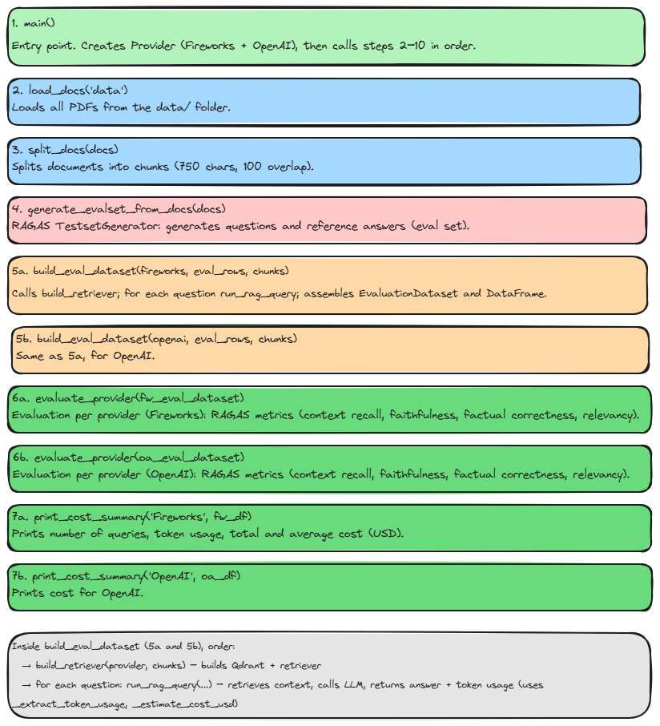
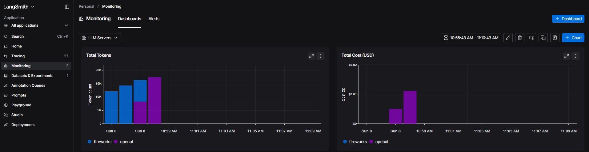

<p align = "center" draggable="false" >
</p>

## <h1 align="center" id="heading">Session 16: LLM Servers</h1>

| 📰 Session Sheet                                  | ⏺️ Recording                           | 🖼️ Slides                                   | 👨‍💻 Repo       | 📝 Homework                                              | 📁 Feedback                        |
| ------------------------------------------------- | -------------------------------------- | ------------------------------------------- | ------------- | -------------------------------------------------------- | ---------------------------------- |
| [Session 16: LLM Servers](https://www.notion.so/) | [Recording!](https://us02web.zoom.us/) | [Session 16 Slides](https://www.canva.com/) | You are here! | [Session 16 Assignment: LLM Servers](https://forms.gle/) | [AIE9 Feedback](https://forms.gle) |

**⚠️!!! PLEASE BE SURE TO SHUTDOWN YOUR DEDICATED ENDPOINT ON FIREWORKS AI WHEN YOU'RE FINISHED YOUR ASSIGNMENT !!!⚠️**

# Build 🏗️

In today's assignment, we'll be creating Fireworks AI endpoints, and then building a RAG application.

- 🤝 Breakout Room #1
  - Set-up Open Source Endpoint (Instructions [here](./ENDPOINT_SETUP.md)) ((This process may take 15-20min.))
  - Test Endpoint and Embeddings with the `endpoint_slammer.ipynb` notebook.

- 🤝 Breakout Room #2
  - Use the Open Source Endpoints to build a RAG LangGraph application

# Ship 🚢

The completed notebook and your RAG app/notebook!

### Deliverables

- A short Loom of either:
  - the notebook and the RAG application you built for the Main Homework Assignment; or
  - the notebook you created for the Advanced Build

# Share 🚀

Make a social media post about your final application!

### Deliverables

- Make a post on any social media platform about what you built!

Here's a template to get you started:

```
🚀 Exciting News! 🚀

I am thrilled to announce that I have just built and shipped a RAG application powered by open-source endpoints! 🎉🤖

🔍 Three Key Takeaways:
1️⃣
2️⃣
3️⃣

Let's continue pushing the boundaries of what's possible in the world of AI and question-answering. Here's to many more innovations! 🚀
Shout out to @AIMakerspace !

#LangChain #QuestionAnswering #RetrievalAugmented #Innovation #AI #TechMilestone

Feel free to reach out if you're curious or would like to collaborate on similar projects! 🤝🔥
```

# Submitting You Homework [OPTIONAL]

## Main Homework Assignment

Follow these steps to prepare and submit your homework assignment:

1. Follow the instructions in `ENDPOINT_SETUP.md`
2. Replace both `model` values in `endpoint_slammer.ipynb` with the `gpt-oss` endpoint you created in Step 1
3. Run the code cells in `endpoint_slammer.ipynb`
4. Respond to the questions in the section below
5. Build a sample RAG
6. Record a Loom video reviewing what you have learned from this session

**⚠️!!! PLEASE BE SURE TO SHUTDOWN YOUR DEDICATED ENDPOINT ON FIREWORKS AI WHEN YOU HAVE FINISHED YOUR ASSIGNMENT !!!⚠️**

## Questions

### ❓ Question #1:

What is the difference between serverless and dedicated endpoints?

#### ✅ Answer:

Serverless endpoints run on shared infrastructure: you call a fixed model ID (for example accounts/fireworks/models/gpt-oss-20b) without creating or managing any deployment. Capacity is shared with other users, so latency and throughput can vary, and you usually pay per request or per token with no guaranteed capacity.
Dedicated (on-demand) endpoints are deployments reserved for you. You create a deployment (e.g. with firectl or the Fireworks Web UI), choose the model, GPU type, and number of replicas, and get reserved capacity and more predictable latency. You can configure scaling (e.g. min/max replicas, scale-to-zero after idle time), but while replicas are running you pay for that reserved compute (e.g. hourly), not only per request.
In practice, serverless is simpler and cost-effective for low or sporadic traffic, whereas dedicated endpoints give you stable throughput and more control at the cost of managing the deployment and paying for reserved capacity when it is running.

### ❓ Question #2:

Why is it important to consider token throughput and latency when choosing an LLM for user-facing applications?

#### ✅ Answer:

Latency is how long the user waits for the first token and for the full reply. In user-facing apps, high latency makes the product feel slow and can push users away. If the model takes many seconds to start answering, the experience is poor even when the content is good.
Token throughput is how many tokens the model can produce per second. Low throughput stretches the time to complete an answer and again hurts perceived speed. For chat or support apps where answers are streamed, both time-to-first-token and tokens-per-second matter.
Choosing an LLM without considering latency and throughput can lead to slow, inconsistent responses under load. That affects satisfaction, retention, and the perceived quality of the app. For user-facing applications it is therefore important to pick a model and deployment (e.g. serverless vs dedicated) that meet your latency and throughput requirements, and to test under realistic traffic.

## Activity 1: RAGAS Evaluation with Cost Analysis

Use RAGAS to evaluate your open-source Fireworks AI powered RAG app against an OpenAI `gpt-4.1-mini` powered equivalent. Compare retrieval quality, answer faithfulness, and end-to-end accuracy across both providers.

Additionally, instrument both pipelines with **LangSmith** to capture token usage and cost per query. Use LangSmith's tracing and cost dashboards to compare the total cost of running each provider at scale. Include your evaluation results, cost breakdown, and analysis in your Loom video.

Activity 1 ANSWEAR
The activity1_eval script loads PDFs from the data folder, splits them into chunks, and uses RAGAS to generate an evaluation set of questions and reference answers. It builds two RAG pipelines, one with Fireworks (open-source model and embeddings) and one with OpenAI (gpt-4.1-mini and text-embedding-3-small), and runs the same questions through both. For each provider it retrieves context with a Qdrant vector store, calls the LLM to answer, records token usage and estimated cost, and then runs RAGAS evaluation (context recall, faithfulness, factual correctness, answer relevancy). Finally it prints a comparison table of metrics, token counts, and costs for both providers. In the results, OpenAI (gpt-4.1-mini) scores higher on all RAGAS metrics (context recall about 0.78, faithfulness about 0.76, factual correctness about 0.53, answer relevancy about 0.77), while Fireworks (gpt-oss-20b) scores lower (roughly 0.14–0.35). Fireworks is cheaper per query (about $0.00019) and OpenAI is more expensive (about $0.00054). For the same 30 queries, Fireworks used more tokens (35,302) than OpenAI (25,734)for the same 30 queries. A larger commercial model like GPT-4.1-mini is expected to use the retrieved context better and give more relevant answers. Context recall differs because each provider uses its own embeddings and retriever, and in this setup OpenAI retrieves more relevant chunks than Fireworks. Fireworks remains cheaper per token despite higher total token usage, which fits typical open-source pricing, and the higher token count on Fireworks can come from longer or less concise answers from the smaller model. Overall, the results are consistent: better RAG quality with OpenAI and lower cost with Fireworks, which is exactly the trade-off the script is designed to show between an open-source and a commercial RAG pipeline.

ACTIVITY EVAL SCRIPT FLOW


LANGSMITH EVAL RESULTS


## Advanced Activity: Local Models

Swap out the Fireworks AI endpoints for **locally-running open-source models** using [Ollama](https://ollama.com/) or another local inference server of your choice. Run both your embedding model and your chat model locally, and rebuild the RAG pipeline on top of them.

- Compare quality and latency between the local setup and your Fireworks AI hosted endpoint.
- Reflect: what are the trade-offs of local models vs. managed endpoints in a production setting?

Include your findings and a demo in your Loom video.
